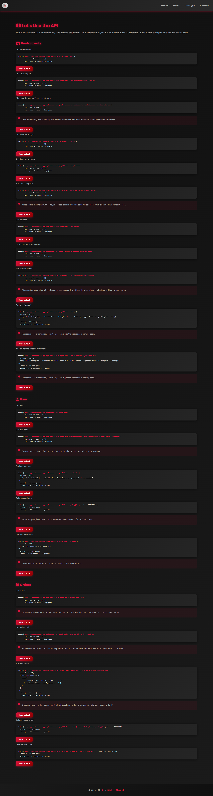
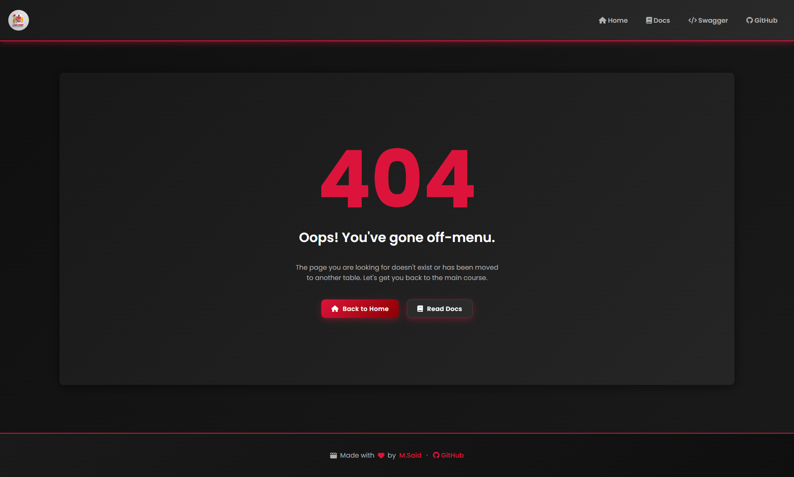

# 🍽️ Cinematic Restaurant API

A premium, high-performance .NET 8 Web API designed for modern restaurant management. This project features a stunning "Cinematic" design system with glassmorphism, real-time documentation, and robust backend architecture.

---

### 🏢 About Apptunix
This project was developed as a professional technical task for **[Apptunix](https://www.apptunix.com)**.

**Apptunix** is a global product engineering and software development company founded in 2013. They specialize in delivering AI-powered, enterprise-grade digital solutions, including custom mobile and web applications, IoT, and blockchain services. With over 2,000 digital products delivered for 500+ global brands, Apptunix is a leader in digital transformation.

---

## 🚀 Quick Links
| Resource | Description | Path |
| :--- | :--- | :--- |
| **🏠 Home** | Cinematic Landing Page | [/](http://localhost:5124/) |
| **📜 Documentation** | Interactive API Docs | [/Docs.html](http://localhost:5124/Docs.html) |
| **🛠️ Swagger UI** | API Explorer | [/index.html](http://localhost:5124/index.html) |

---

## 🖼️ UI Showcase






---

## ✨ Key Features

- **🍔 Menu Management**: Dynamic restaurant and item management with categorized listings.
- **🛒 Smart Cart**: Persistent shopping cart management via dedicated endpoints.
- **📋 Real-time Orders**: Seamless order placement and tracking system.
- **🔐 User Profiles**: High-security user management and profile handling.
- **🎨 Cinematic UI**: A professional-grade CSS design system (Glassmorphism + Crimson Theme).
- **🐳 Docker Ready**: Full containerization support for instant deployment.
- **🤖 CI/CD Integration**: Automated GitHub Actions pipeline for build and test validation.

---

## 🛠️ API Architecture

The application follows a clean middleware-driven architecture:
- **Controllers**: Thin controllers handling HTTP request/response.
- **Configurations**: Decoupled Swagger and Middleware setup for better maintainability.
- **Static Assets**: All premium UI files served directly from `wwwroot`.

### Core Endpoints
- `GET /api/restaurant` - List all restaurants.
- `GET /api/restaurant/{id}` - Get detailed menu items.
- `POST /api/cart` - Add items to shopping cart.
- `POST /api/order` - Place a new order.
- `GET /api/user/profile` - Retrieve user details.

---

## 🐳 Running with Docker

You can launch the entire stack in seconds using Docker:

```bash
docker-compose up --build
```
The API will be available at `http://localhost:5124`.

---

## 🏗️ Development

### Prerequisites
- .NET 8.0 SDK
- Docker (optional)

### Build & Run
```bash
dotnet restore
dotnet build
dotnet run --project api/RestaurantApi.csproj
```

---

*Developed by M.Said for Apptunix.*
