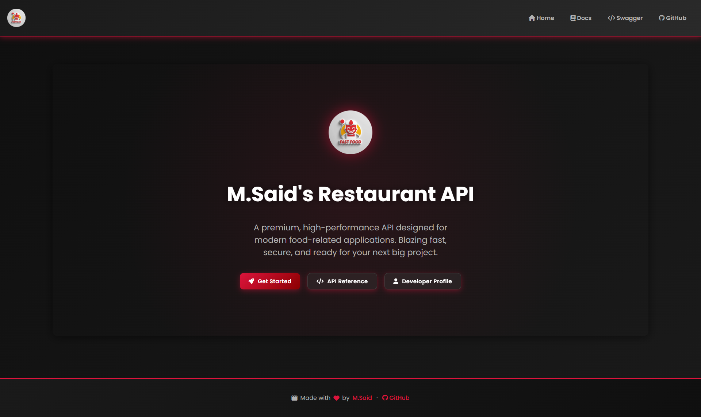

# 🍽️ Cinematic Restaurant API

A premium, high-performance **.NET 8 Web API** for modern restaurant management — featuring a stunning Cinematic glassmorphism UI, robust clean architecture, and production-ready DevOps infrastructure.

> **Developed as a professional technical task for [Apptunix](https://www.apptunix.com)** — a global product engineering company specializing in AI-powered, enterprise-grade digital solutions.

---

## 🚀 Quick Links

| Resource | Description | URL |
| :--- | :--- | :--- |
| 🏠 **Home** | Cinematic Landing Page | [`/Home.html`](http://localhost:5124/Home.html) |
| 📜 **Docs** | Interactive API Documentation | [`/Docs.html`](http://localhost:5124/Docs.html) |
| 🛠️ **Swagger** | OpenAPI Explorer & Testing | [`/index.html`](http://localhost:5124/index.html) |

---

## 🖼️ UI Showcase



---

## 📚 Documentation

All detailed guides live in the [`docs/`](docs/) folder:

| Guide | Description |
| :--- | :--- |
| [✨ Features Overview](docs/FEATURES.md) | Full breakdown of API capabilities |
| [🏗️ Project Structure](docs/STRUCTURE.md) | File organization and architectural patterns |
| [💻 Technologies Stack](docs/TECHNOLOGIES.md) | Frameworks, tools, and libraries used |
| [📝 API Endpoints](docs/API_ENDPOINTS.md) | Comprehensive list of all routes and payloads |
| [📊 Entity Relationship Diagram](docs/ERD.md) | Database schema and relationship visualization |
| [🎨 Cinematic Design System](docs/STYLES.md) | Premium glassmorphism UI documentation |
| [🛡️ Security Guide](docs/SECURITY.md) | API Key auth, CORS, and best practices |
| [⚙️ Project Setup](docs/PROJECT_SETUP.md) | Step-by-step local development guide |
| [🚢 Deployment Strategy](docs/DEPLOYMENT.md) | Docker and production build instructions |
| [📋 Use Cases](docs/USE_CASES.md) | Detailed actor scenarios and business flows |
| [🤝 Contributing](docs/CONTRIBUTING.md) | How to contribute to this project |
| [📜 Code of Conduct](docs/CODE_OF_CONDUCT.md) | Community standards and guidelines |
| [📋 Changelog](docs/CHANGELOG.md) | Version history and release notes |
| [👥 Contributors](docs/CONTRIBUTORS.md) | Project team and hall of fame |

---

## ⚡ Getting Started

```bash
# Clone the repository
git clone https://github.com/Mostafa-SAID7/restaurant-app-api.git

# Run with Docker (recommended)
docker-compose up --build

# Or run locally
cd api
dotnet restore && dotnet run
```

The API will be available at **`http://localhost:5124`**.

> For a full setup walkthrough, see [⚙️ Project Setup](docs/PROJECT_SETUP.md).

---

*Developed by **[M.Said](https://m-said-portfolio.netlify.app)** for [Apptunix](https://www.apptunix.com).*
